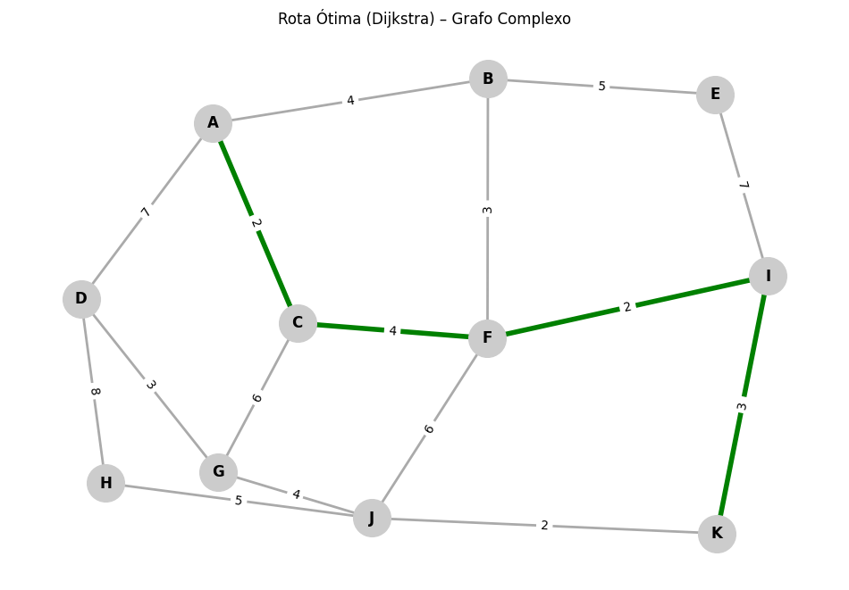

# 🚦 Otimizador de Rotas para Transporte — Projeto de Portfólio
*Visualização e comparação de algoritmos de caminho mínimo aplicados a malhas viárias sintéticas.*

---

## 🔎 Descrição do Projeto
Projeto que demonstra modelagem e solução do **Shortest Path Problem** para transporte rodoviário em malhas reduzidas (mapas artificiais). O foco é **documentar competência técnica**: modelagem matemática, escolha de algoritmos, análise comparativa e visualização clara das rotas (ineficientes vs. otimizadas).

---

## 🎯 Objetivo
Dado um grafo ponderado que modela uma malha viária simplificada, encontrar o **caminho de menor custo** (distância) entre uma origem \(s\) e um destino \(t\), comparar diferentes estratégias de busca e ilustrar visualmente os resultados para portfólio.

---

## 🧠 Tecnologias usadas
- **Linguagem:** Python 3  
- **Bibliotecas principais:**  
  - `networkx` — construção e análise do grafo (algoritmos: Dijkstra, A*, etc.)  
  - `numpy` — suporte numérico e vetorização  
  - `matplotlib` — visualizações estáticas das malhas e rotas  
  - `folium` (opcional em versões interativas) — mapas interativos para demonstração  
- **Categoria técnica:** Pesquisa Operacional, Algoritmos em Grafos, Visualização Geoespacial

---

## 📐 Formulação matemática 

**Dados**
- Grafo ponderado \( G = (V, E) \)
- Cada aresta \((u,v) \in E\) tem custo \( w(u,v) \ge 0 \)

**Variáveis de decisão**
- \(x_{uv} \in \{0,1\}\) indica se a aresta \((u,v)\) é usada no caminho.

**Objetivo**
\[
\min \; Z = \sum_{(u,v) \in E} w(u,v) \cdot x_{uv}
\]

**Restrições principais**
1. Fluxo de origem \(s\):
\[
\sum_{v:(s,v)\in E} x_{sv} - \sum_{v:(v,s)\in E} x_{vs} = 1
\]
2. Fluxo de destino \(t\):
\[
\sum_{v:(v,t)\in E} x_{vt} - \sum_{v:(t,v)\in E} x_{tv} = 1
\]
3. Continuidade de fluxo (nós intermediários):
\[
\sum_{v:(i,v)\in E} x_{iv} - \sum_{v:(v,i)\in E} x_{vi} = 0,\quad \forall i \in V\setminus\{s,t\}
\]
4. Binário:
\[
x_{uv} \in \{0,1\}
\]

**Observações**
- Modelagem a nível de rota mínima (single-source single-target).
- Para grafos esparsos e grandes, usa-se Dijkstra (ou A* com heurística admissível) por eficiência.
- Problemas extensos podem incorporar custos adicionais: tempo esperado, pedágio, restrições de peso/altura, preferências de via.

---

## 📈 Algoritmos implementados e comportamento esperado

- **Dijkstra** — garante solução ótima em grafos com pesos não-negativos; complexidade prática: \(O((V+E)\log V)\).
- **A\*** — ótimo quando heurística é admissível; acelera busca espacialmente guiada.
- **Greedy Best-First** — rápido, prioriza heurística, não garante ótimo.
- **BFS** — encontra menor número de arestas (não leva em conta pesos).
- **DFS** — exploração profunda, frequentemente gera soluções pessimizadas para custo.
- **Comparativo visual** — cada algoritmo desenha seu caminho sobre a mesma malha: ruas "ineficientes" em vermelho, rota "otimizada" em verde.

---

## 🧮 Métricas e análise
Para cada execução registram-se:
- `cost_best` — custo total do caminho (soma de pesos)
- `path_length` — número de arestas do caminho
- `time_sec` — tempo de execução
- `optimality_gap` — diferença percentual para solução ótima (quando conhecida)
- `feasibility` — validação se o caminho é factível no grafo

Exemplo de interpretação:  
- Se Dijkstra encontra custo 11 e Greedy encontra 13 → `optimality_gap = (13-11)/11 * 100 ≈ 18.18%`.

---

## 🔎 Resultados exemplares (amostra do projeto)
Para grafos sintéticos testados:

- Exemplo 1 (malha pequena): **Rota ótima** A → B → C → D, **Custo** = 6  
- Exemplo 2 (malha complexa): **Rota ótima** A → C → F → I → K, **Custo** = 11

Esses resultados ilustram que algoritmos ótimos (Dijkstra/A*) coincidem e que heurísticas podem divergir (DFS mostrou rota subótima em alguns testes).

---

